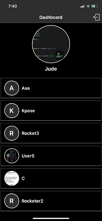
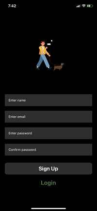

# RocketChater (iOS chat app)

RocketChater is an iOS application built with Expo, to have a feel of its awesomeness, the procedure below should be followed.

## Preview






## Included

- Firebase for database management
- Context API for state management
- Navigating with React Navigation
- Annimation with Lottie files
- Layout design with Nativebase
- Image selection and upload

## Usage

1. Install [node.js](https://nodejs.org/en/)
2. Install Expo

   ```jsx
   npm install --global expo-cli
   ```

3. Clone the repository to your machine
4. Install deps on your template folder

   ```jsx
   npm install
   ```

5. Start the environtment

   ```jsx
   expo start
   ```

## Documentation

> Note: There are some custom components I made
